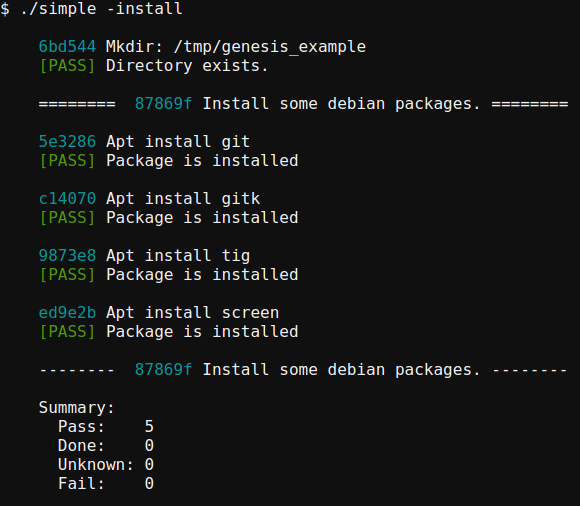

Genesis
=======

Genesis is a Go library for building stand-alone installers.
It is intended as a configuration management utility for
embedded systems, but it can be used for pretty much any system.

Genesis can install, uninstall (reverse all installation steps), and
report status. You can tell it to re-run certain steps or sections,
and/or to skip some.

Status
------

This is experimental software, with high API instability.
However, I am currently using it in my own work.

Motivation
----------

Traditional configuration management systems (chef, ansible, etc.)
don't work well for embedded systems because they tend to assume:

- the target is accessible by network and the network has been configured
- the target is running an ssh server
- supporting software has been installed (python, chef client, etc).

Genesis is designed to configure a system *from scratch*.  See the `doc`
directory for more information.

Example
-------

Here is a very simple example:

    package main

    import (
        "github.com/wx13/genesis/installer"
        "github.com/wx13/genesis/modules"
    )

    func main() {

        inst := installer.New()
        defer inst.Done()

        inst.AddTask(modules.Mkdir{Path: "/tmp/genesis_example"})

        aptSection := installer.NewSection("Install some debian packages.")
        pkgs := []string{"git", "gitk", "tig", "screen"}
        for _, pkg := range pkgs {
            aptSection.AddTask(modules.Apt{Name: pkg})
        }
        inst.Add(aptSection)

    }

which produces this:

See the `example` directory for more examples.

Build
-----

To build the installer, first zip up the supporting files:

    zip -r files.zip files

Now build the executable and append the zip file:

    go build my_installer.go
    cat files.zip >> my_installer
    zip -A my_installer

This packages the zip file into the installer binary, so that
it is completely standalone.  Run the binary with the `-install`, `-status`,
or `-remove` flags to install / check status / remove.

